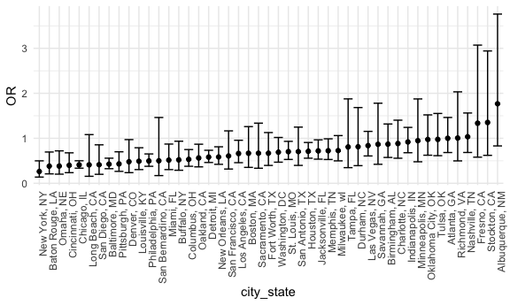
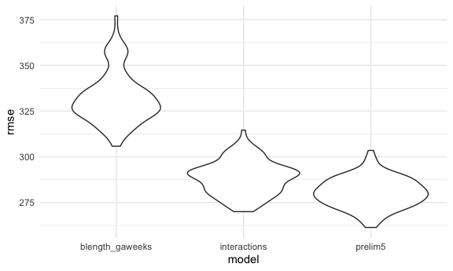

p8105\_hw6\_isn2102.Rmd
================
Isabel Nelson
11/22/2020

### Problem 1

``` r
homicide_df <- 
  read_csv("data/homicide-data.csv", na = c("", "NA", "Unknown")) %>% 
  mutate(
    city_state = str_c(city, state, sep = ", "),
    victim_age = as.numeric(victim_age), 
    resolved = case_when(
      disposition == "Closed without arrest" ~ 0, 
      disposition == "Open/No arrest" ~ 0, 
      disposition == "Closed by arrest" ~ 1,
    )
  ) %>% 
  filter(
    city_state != "Tulsa, AL", 
    victim_race %in% c("White", "Black")) %>% 
  select(city_state, resolved, victim_age, victim_race, victim_sex)
```

Start with one city, fit a linear model to relate resolution to these
three variables.

``` r
baltimore_df <-
  homicide_df %>% 
  filter(city_state == "Baltimore, MD")

glm(resolved ~ victim_age + victim_race + victim_sex, 
    data = baltimore_df, 
    family = binomial()) %>% 
  broom::tidy() %>% 
  mutate(
    OR = exp(estimate), 
    CI_lower = exp(estimate - 1.96 * std.error), 
    CI_upper = exp(estimate + 1.96 * std.error)
  ) %>% 
  select(term, OR, starts_with("CI")) %>% 
  knitr::kable(digits = 3)
```

| term              |    OR | CI\_lower | CI\_upper |
| :---------------- | ----: | --------: | --------: |
| (Intercept)       | 1.363 |     0.975 |     1.907 |
| victim\_age       | 0.993 |     0.987 |     1.000 |
| victim\_raceWhite | 2.320 |     1.648 |     3.268 |
| victim\_sexMale   | 0.426 |     0.325 |     0.558 |

Now we will do this with iteration to look at every city.

``` r
model_results_df <-
homicide_df %>% 
  nest(data = -city_state) %>% 
  mutate(
    models = 
      map(.x = data, ~glm(resolved ~ victim_age + victim_race + victim_sex, data = .x, family = binomial())), 
    results = map(models, broom::tidy)
  ) %>% 
  select(city_state, results) %>% 
  unnest(results) %>% 
  mutate(
    OR = exp(estimate), 
    CI_lower = exp(estimate - 1.96 * std.error), 
    CI_upper = exp(estimate + 1.96 * std.error)
  ) %>% 
  select(city_state, term, OR, starts_with("CI"))
```

Make a plot:

``` r
model_results_df %>% 
  filter(term == "victim_sexMale") %>% 
  mutate(city_state = fct_reorder(city_state, OR)) %>% 
  ggplot(aes(x = city_state, y = OR)) + 
  geom_point() +
  geom_errorbar(aes(ymin = CI_lower, ymax = CI_upper)) +
  theme(axis.text.x = element_text(angle = 90, hjust = 1))
```



### Problem 2

Import and clean data:

``` r
birthweight_df <- 
  read_csv("./data/birthweight.csv") %>% 
  mutate(
    babysex = as.factor(babysex), 
    frace = as.factor(frace), 
    malform = as.factor(malform), 
    mrace = as.factor(mrace)
  ) 
```

Check for missing variables: none. Can try to figure out a way to do
this in a function so it’s not as much typing, but not exactly sure how
to do that yet, in progress.

``` r
variable_list <- names(birthweight_df)

find_nas = function(df, variable) {
  df %>% 
    summarise(
      na_num = sum(is.na("variable")))
}

#output_df = map(output_list, bind_rows))
#na_summary <- 
#  variable_list %>% 
#  map(variable_list, find_nas(df = birthweight_df, ))

na_summary <- 
  birthweight_df %>% 
  summarise(babysex_na = sum(is.na(babysex)), 
            bhead_na = sum(is.na(bhead)),
            blength_na = sum(is.na(blength)),
            bwt_na = sum(is.na(bwt)),
            delwt_na = sum(is.na(delwt)),
            fincome_na = sum(is.na(fincome)),
            frace_na = sum(is.na(frace)),
            gaweeks_na = sum(is.na(gaweeks)),
            malform_na = sum(is.na(malform)),
            menarche_na = sum(is.na(menarche)),
            mheigth_na = sum(is.na(mheight)),
            momage_na = sum(is.na(momage)),
            mrace_na = sum(is.na(mrace)),
            parity_na = sum(is.na(parity)),
            pnumlbw_na = sum(is.na(pnumlbw)),
            pnumgsa_na = sum(is.na(pnumsga)),
            ppbmi_na = sum(is.na(ppbmi)),
            ppwt_na = sum(is.na(ppwt)),
            smoken_na = sum(is.na(smoken)),
            wtgain_na = sum(is.na(wtgain)),
  )
na_summary %>% knitr::kable(digits = 5)
```

| babysex\_na | bhead\_na | blength\_na | bwt\_na | delwt\_na | fincome\_na | frace\_na | gaweeks\_na | malform\_na | menarche\_na | mheigth\_na | momage\_na | mrace\_na | parity\_na | pnumlbw\_na | pnumgsa\_na | ppbmi\_na | ppwt\_na | smoken\_na | wtgain\_na |
| ----------: | --------: | ----------: | ------: | --------: | ----------: | --------: | ----------: | ----------: | -----------: | ----------: | ---------: | --------: | ---------: | ----------: | ----------: | --------: | -------: | ---------: | ---------: |
|           0 |         0 |           0 |       0 |         0 |           0 |         0 |           0 |           0 |            0 |           0 |          0 |         0 |          0 |           0 |           0 |         0 |        0 |          0 |          0 |

**Model building process:**

1.  Select a subset of variables that are expected to be related to
    birthweight based on theoretical knowledge: bhead, blength, delwt,
    fincome, gaweeks, momage, mrace, pnumlbw, pnumsga, ppbmi, smoken,
    wtgain

2.  Look at plots to see the relationship between each possible
    predictor and the outcome. Choose predictors that have a linear
    relationship with the outcome to move forward.

<!-- end list -->

``` r
bhead_plot <-
birthweight_df %>% 
  ggplot(aes(x = bhead, y = bwt)) + 
  geom_point()
blength_plot <-
birthweight_df %>% 
  ggplot(aes(x = blength, y = bwt)) + 
  geom_point()
delwt_plot <-
birthweight_df %>% 
  ggplot(aes(x = delwt, y = bwt)) + 
  geom_point()
fincome_plot <-
birthweight_df %>% 
  ggplot(aes(x = fincome, y = bwt)) + 
  geom_point()
gaweeks_plot <-
birthweight_df %>% 
  ggplot(aes(x = gaweeks, y = bwt)) + 
  geom_point()
momage_plot <-
birthweight_df %>% 
  ggplot(aes(x = momage, y = bwt)) + 
  geom_point()
mrace_plot <-
birthweight_df %>% 
  ggplot(aes(x = mrace, y = bwt)) + 
  geom_point()
pnumlbw_plot <-
birthweight_df %>% 
  ggplot(aes(x = pnumlbw, y = bwt)) + 
  geom_point()
pnumsga_plot <-
birthweight_df %>% 
  ggplot(aes(x = pnumsga, y = bwt)) + 
  geom_point()
ppbmi_plot <-
birthweight_df %>% 
  ggplot(aes(x = ppbmi, y = bwt)) + 
  geom_point()
smoken_plot <-
birthweight_df %>% 
  ggplot(aes(x = smoken, y = bwt)) + 
  geom_point()
wtgain_plot <-
birthweight_df %>% 
  ggplot(aes(x = wtgain, y = bwt)) + 
  geom_point()

(bhead_plot + blength_plot + delwt_plot + fincome_plot + gaweeks_plot + momage_plot + mrace_plot + pnumlbw_plot + pnumsga_plot + ppbmi_plot + smoken_plot + wtgain_plot + plot_layout(ncol = 4))
```


From these plots we see that pnumlbw and pnumsga only have one value
each for all observations (zero), so we will remove those two.
Additionally, it looks like wtgain is not linear so we will remove that
as well. Mrace can be coded as dummy variables so we will keep that in
the model for now.

3.  Fit a bivariate linear model for each variable, and choose variables
    that seem like they may have a substantial relationship.

<!-- end list -->

``` r
bhead_biv <- lm(bwt ~ bhead, data = birthweight_df)
broom::tidy(bhead_biv) %>% knitr::kable(digits = 5)
```

| term        |   estimate | std.error |  statistic | p.value |
| :---------- | ---------: | --------: | ---------: | ------: |
| (Intercept) | \-4830.866 |  107.4267 | \-44.96894 |       0 |
| bhead       |    236.109 |    3.1887 |   74.04559 |       0 |

``` r
blength_biv <- lm(bwt ~ blength, data = birthweight_df)
broom::tidy(blength_biv) %>% knitr::kable(digits = 5)
```

| term        |    estimate | std.error |  statistic | p.value |
| :---------- | ----------: | --------: | ---------: | ------: |
| (Intercept) | \-3841.2667 |  95.12217 | \-40.38246 |       0 |
| blength     |    139.8109 |   1.90912 |   73.23301 |       0 |

``` r
delwt_biv <- lm(bwt ~ delwt, data = birthweight_df)
broom::tidy(delwt_biv) %>% knitr::kable(digits = 5)
```

| term        |   estimate | std.error | statistic | p.value |
| :---------- | ---------: | --------: | --------: | ------: |
| (Intercept) | 2147.91152 |  49.36689 |  43.50915 |       0 |
| delwt       |    6.63927 |   0.33525 |  19.80420 |       0 |

``` r
fincome_biv <- lm(bwt ~ fincome, data = birthweight_df)
broom::tidy(fincome_biv) %>% knitr::kable(digits = 5)
```

| term        |   estimate | std.error | statistic | p.value |
| :---------- | ---------: | --------: | --------: | ------: |
| (Intercept) | 2979.98719 |  15.13478 | 196.89658 |       0 |
| fincome     |    3.04764 |   0.29569 |  10.30684 |       0 |

``` r
gaweeks_biv <- lm(bwt ~ gaweeks, data = birthweight_df)
broom::tidy(gaweeks_biv) %>% knitr::kable(digits = 5)
```

| term        |  estimate | std.error | statistic | p.value |
| :---------- | --------: | --------: | --------: | ------: |
| (Intercept) | 476.00261 |  88.80909 |   5.35984 |       0 |
| gaweeks     |  66.91991 |   2.24536 |  29.80361 |       0 |

``` r
momage_biv <- lm(bwt ~ momage, data = birthweight_df)
broom::tidy(momage_biv) %>% knitr::kable(digits = 5)
```

| term        |   estimate | std.error | statistic | p.value |
| :---------- | ---------: | --------: | --------: | ------: |
| (Intercept) | 2750.40746 |  41.04679 |  67.00664 |       0 |
| momage      |   17.93159 |   1.98618 |   9.02817 |       0 |

``` r
mrace_biv <- lm(bwt ~ mrace, data = birthweight_df)
broom::tidy(mrace_biv) %>% knitr::kable(digits = 5)
```

| term        |   estimate | std.error |  statistic | p.value |
| :---------- | ---------: | --------: | ---------: | ------: |
| (Intercept) |  3266.6628 |  10.54914 |  309.66162 | 0.00000 |
| mrace2      | \-316.5638 |  15.37669 | \-20.58725 | 0.00000 |
| mrace3      | \-126.4302 |  75.28436 |  \-1.67937 | 0.09315 |
| mrace4      | \-211.3212 |  33.08360 |  \-6.38749 | 0.00000 |

``` r
ppbmi_biv <- lm(bwt ~ ppbmi, data = birthweight_df)
broom::tidy(ppbmi_biv) %>% knitr::kable(digits = 5)
```

| term        |   estimate | std.error | statistic | p.value |
| :---------- | ---------: | --------: | --------: | ------: |
| (Intercept) | 2788.25190 |  53.03312 |  52.57567 |       0 |
| ppbmi       |   15.12037 |   2.43229 |   6.21651 |       0 |

``` r
smoken_biv <- lm(bwt ~ smoken, data = birthweight_df)
broom::tidy(smoken_biv) %>% knitr::kable(digits = 5)
```

| term        |   estimate | std.error | statistic | p.value |
| :---------- | ---------: | --------: | --------: | ------: |
| (Intercept) | 3136.07856 |   8.88234 | 353.06882 |       0 |
| smoken      |  \-5.22887 |   1.04649 | \-4.99657 |       0 |

From this exploration we can see that all variables tested had p-values
that were very small (most show up as zero).

4.  Fit a preliminary model with all these predictors.

<!-- end list -->

``` r
prelim_model <- lm(bwt ~ bhead + blength + delwt + fincome + gaweeks + momage + mrace + ppbmi + smoken, data = birthweight_df)
```

5.  Look at the t test statistic for each variable to see significant
    ones. Also remove predictor from model and if the other parameter
    estimates change, keep variable in the model. Remove variables that
    do not change other estimates much when removing them, or with
    insignificant p-values.

<!-- end list -->

``` r
summary(prelim_model) 
```

    ## 
    ## Call:
    ## lm(formula = bwt ~ bhead + blength + delwt + fincome + gaweeks + 
    ##     momage + mrace + ppbmi + smoken, data = birthweight_df)
    ## 
    ## Residuals:
    ##      Min       1Q   Median       3Q      Max 
    ## -1114.67  -180.29    -3.35   173.83  2327.04 
    ## 
    ## Coefficients:
    ##               Estimate Std. Error t value Pr(>|t|)    
    ## (Intercept) -5614.8467   101.3782 -55.385  < 2e-16 ***
    ## bhead         129.3980     3.4111  37.934  < 2e-16 ***
    ## blength        74.7144     2.0227  36.938  < 2e-16 ***
    ## delwt           3.6347     0.2848  12.763  < 2e-16 ***
    ## fincome         0.2700     0.1787   1.511   0.1309    
    ## gaweeks        11.9456     1.4523   8.225 2.55e-16 ***
    ## momage          0.3079     1.1876   0.259   0.7955    
    ## mrace2       -138.4541    10.2181 -13.550  < 2e-16 ***
    ## mrace3        -79.2072    42.7197  -1.854   0.0638 .  
    ## mrace4        -94.8208    19.1980  -4.939 8.14e-07 ***
    ## ppbmi         -12.6530     1.9277  -6.564 5.87e-11 ***
    ## smoken         -4.9522     0.5862  -8.448  < 2e-16 ***
    ## ---
    ## Signif. codes:  0 '***' 0.001 '**' 0.01 '*' 0.05 '.' 0.1 ' ' 1
    ## 
    ## Residual standard error: 272.9 on 4330 degrees of freedom
    ## Multiple R-squared:  0.7167, Adjusted R-squared:  0.716 
    ## F-statistic: 995.8 on 11 and 4330 DF,  p-value: < 2.2e-16

``` r
prelim_model2 <- lm(bwt ~ bhead + blength + delwt + gaweeks + mrace + ppbmi + smoken, data = birthweight_df)
summary(prelim_model2)
```

    ## 
    ## Call:
    ## lm(formula = bwt ~ bhead + blength + delwt + gaweeks + mrace + 
    ##     ppbmi + smoken, data = birthweight_df)
    ## 
    ## Residuals:
    ##      Min       1Q   Median       3Q      Max 
    ## -1121.74  -179.62    -3.01   172.58  2314.76 
    ## 
    ## Coefficients:
    ##               Estimate Std. Error t value Pr(>|t|)    
    ## (Intercept) -5598.8294    99.5597 -56.236  < 2e-16 ***
    ## bhead         129.6223     3.4085  38.030  < 2e-16 ***
    ## blength        74.5772     2.0210  36.901  < 2e-16 ***
    ## delwt           3.6505     0.2846  12.826  < 2e-16 ***
    ## gaweeks        12.0251     1.4507   8.289  < 2e-16 ***
    ## mrace2       -144.9746     9.2209 -15.722  < 2e-16 ***
    ## mrace3        -80.7445    42.3494  -1.907   0.0566 .  
    ## mrace4       -100.3123    18.8795  -5.313 1.13e-07 ***
    ## ppbmi         -12.6864     1.9191  -6.610 4.30e-11 ***
    ## smoken         -4.9783     0.5861  -8.495  < 2e-16 ***
    ## ---
    ## Signif. codes:  0 '***' 0.001 '**' 0.01 '*' 0.05 '.' 0.1 ' ' 1
    ## 
    ## Residual standard error: 273 on 4332 degrees of freedom
    ## Multiple R-squared:  0.7165, Adjusted R-squared:  0.7159 
    ## F-statistic:  1217 on 9 and 4332 DF,  p-value: < 2.2e-16

``` r
prelim_model3 <- lm(bwt ~ bhead + blength + delwt + gaweeks + ppbmi + mrace, data = birthweight_df)
summary(prelim_model3)
```

    ## 
    ## Call:
    ## lm(formula = bwt ~ bhead + blength + delwt + gaweeks + ppbmi + 
    ##     mrace, data = birthweight_df)
    ## 
    ## Residuals:
    ##     Min      1Q  Median      3Q     Max 
    ## -1108.2  -185.6    -1.0   177.6  2385.7 
    ## 
    ## Coefficients:
    ##               Estimate Std. Error t value Pr(>|t|)    
    ## (Intercept) -5727.1811    99.2112 -57.727  < 2e-16 ***
    ## bhead         131.3883     3.4299  38.306  < 2e-16 ***
    ## blength        76.0179     2.0303  37.441  < 2e-16 ***
    ## delwt           3.4648     0.2861  12.111  < 2e-16 ***
    ## gaweeks        11.5540     1.4615   7.905 3.36e-15 ***
    ## ppbmi         -12.1347     1.9337  -6.275 3.83e-10 ***
    ## mrace2       -123.9492     8.9552 -13.841  < 2e-16 ***
    ## mrace3        -56.6338    42.5997  -1.329    0.184    
    ## mrace4        -85.4698    18.9522  -4.510 6.66e-06 ***
    ## ---
    ## Signif. codes:  0 '***' 0.001 '**' 0.01 '*' 0.05 '.' 0.1 ' ' 1
    ## 
    ## Residual standard error: 275.2 on 4333 degrees of freedom
    ## Multiple R-squared:  0.7118, Adjusted R-squared:  0.7113 
    ## F-statistic:  1338 on 8 and 4333 DF,  p-value: < 2.2e-16

``` r
prelim_model4 <- lm(bwt ~ bhead + blength + delwt + gaweeks + mrace, data = birthweight_df)
summary(prelim_model4)
```

    ## 
    ## Call:
    ## lm(formula = bwt ~ bhead + blength + delwt + gaweeks + mrace, 
    ##     data = birthweight_df)
    ## 
    ## Residuals:
    ##      Min       1Q   Median       3Q      Max 
    ## -1093.28  -184.30    -2.72   175.43  2391.18 
    ## 
    ## Coefficients:
    ##               Estimate Std. Error t value Pr(>|t|)    
    ## (Intercept) -5870.8739    96.9590 -60.550  < 2e-16 ***
    ## bhead         131.7275     3.4447  38.241  < 2e-16 ***
    ## blength        77.0253     2.0329  37.889  < 2e-16 ***
    ## delwt           2.1598     0.1973  10.945  < 2e-16 ***
    ## gaweeks        11.8719     1.4671   8.092 7.56e-16 ***
    ## mrace2       -126.7723     8.9834 -14.112  < 2e-16 ***
    ## mrace3        -51.5992    42.7804  -1.206    0.228    
    ## mrace4       -102.5200    18.8393  -5.442 5.56e-08 ***
    ## ---
    ## Signif. codes:  0 '***' 0.001 '**' 0.01 '*' 0.05 '.' 0.1 ' ' 1
    ## 
    ## Residual standard error: 276.4 on 4334 degrees of freedom
    ## Multiple R-squared:  0.7092, Adjusted R-squared:  0.7087 
    ## F-statistic:  1510 on 7 and 4334 DF,  p-value: < 2.2e-16

``` r
prelim_model5 <- lm(bwt ~ bhead + blength + gaweeks + mrace, data = birthweight_df)
summary(prelim_model5)
```

    ## 
    ## Call:
    ## lm(formula = bwt ~ bhead + blength + gaweeks + mrace, data = birthweight_df)
    ## 
    ## Residuals:
    ##      Min       1Q   Median       3Q      Max 
    ## -1133.74  -185.51    -7.01   179.08  2480.32 
    ## 
    ## Coefficients:
    ##              Estimate Std. Error t value Pr(>|t|)    
    ## (Intercept) -5831.671     98.211 -59.379  < 2e-16 ***
    ## bhead         135.361      3.475  38.950  < 2e-16 ***
    ## blength        79.669      2.046  38.940  < 2e-16 ***
    ## gaweeks        12.386      1.486   8.333  < 2e-16 ***
    ## mrace2       -120.960      9.090 -13.307  < 2e-16 ***
    ## mrace3        -97.414     43.154  -2.257    0.024 *  
    ## mrace4       -120.080     19.026  -6.311 3.04e-10 ***
    ## ---
    ## Signif. codes:  0 '***' 0.001 '**' 0.01 '*' 0.05 '.' 0.1 ' ' 1
    ## 
    ## Residual standard error: 280.2 on 4335 degrees of freedom
    ## Multiple R-squared:  0.7011, Adjusted R-squared:  0.7007 
    ## F-statistic:  1695 on 6 and 4335 DF,  p-value: < 2.2e-16

From this regression output we see that fincome and momage are not
significant anymore so we will remove those. I removed smoken, delwt,
and ppbmi variables and the other coefficients didn’t change much, and
the R^2 is still very high (0.70 compared to 0.72 with the “full” model)
so I will keep those variables out of model. My final model includes
bhead, blength, gaweeks, and mrace.

Plot model residuals against fitted values:

``` r
birthweight_df %>% 
add_residuals(prelim_model5) %>% 
add_predictions(prelim_model5) %>% 
ggplot(aes(x = pred, y = resid)) + 
geom_point()
```


``` r
birthweight_df %>% 
  modelr::add_residuals(prelim_model5) %>% 
  ggplot(aes(x = resid)) +
  geom_density()
```


**Interpretation??**  
Look to see if residuals are normally distributed using geom\_density
(symmetric). Then look at residuals plotted against one of the
predictors. We want to see points centered around zero and have
generally even spread. If you have some dots that are further from zero
in one area then you might not have a great model fit. Don’t want to see
any residuals that are real outliers. Also you don’t really want to see
a clear pattern because that might indicate that you don’t have a linear
relationship.

Fit two additional models:

``` r
model_blength_gaweeks <- lm(bwt ~ blength + gaweeks, data = birthweight_df)
summary(model_blength_gaweeks)
```

    ## 
    ## Call:
    ## lm(formula = bwt ~ blength + gaweeks, data = birthweight_df)
    ## 
    ## Residuals:
    ##     Min      1Q  Median      3Q     Max 
    ## -1709.6  -215.4   -11.4   208.2  4188.8 
    ## 
    ## Coefficients:
    ##              Estimate Std. Error t value Pr(>|t|)    
    ## (Intercept) -4347.667     97.958  -44.38   <2e-16 ***
    ## blength       128.556      1.990   64.60   <2e-16 ***
    ## gaweeks        27.047      1.718   15.74   <2e-16 ***
    ## ---
    ## Signif. codes:  0 '***' 0.001 '**' 0.01 '*' 0.05 '.' 0.1 ' ' 1
    ## 
    ## Residual standard error: 333.2 on 4339 degrees of freedom
    ## Multiple R-squared:  0.5769, Adjusted R-squared:  0.5767 
    ## F-statistic:  2958 on 2 and 4339 DF,  p-value: < 2.2e-16

``` r
model_interactions <- lm(bwt ~ bhead * blength * babysex, data = birthweight_df)
summary(model_interactions)
```

    ## 
    ## Call:
    ## lm(formula = bwt ~ bhead * blength * babysex, data = birthweight_df)
    ## 
    ## Residuals:
    ##      Min       1Q   Median       3Q      Max 
    ## -1132.99  -190.42   -10.33   178.63  2617.96 
    ## 
    ## Coefficients:
    ##                          Estimate Std. Error t value Pr(>|t|)    
    ## (Intercept)            -7176.8170  1264.8397  -5.674 1.49e-08 ***
    ## bhead                    181.7956    38.0542   4.777 1.84e-06 ***
    ## blength                  102.1269    26.2118   3.896 9.92e-05 ***
    ## babysex2                6374.8684  1677.7669   3.800 0.000147 ***
    ## bhead:blength             -0.5536     0.7802  -0.710 0.478012    
    ## bhead:babysex2          -198.3932    51.0917  -3.883 0.000105 ***
    ## blength:babysex2        -123.7729    35.1185  -3.524 0.000429 ***
    ## bhead:blength:babysex2     3.8781     1.0566   3.670 0.000245 ***
    ## ---
    ## Signif. codes:  0 '***' 0.001 '**' 0.01 '*' 0.05 '.' 0.1 ' ' 1
    ## 
    ## Residual standard error: 287.7 on 4334 degrees of freedom
    ## Multiple R-squared:  0.6849, Adjusted R-squared:  0.6844 
    ## F-statistic:  1346 on 7 and 4334 DF,  p-value: < 2.2e-16

Compare the three models by using a cross-validation approach. First
create a set of ten samples with crossv\_mc, then convert to tibbles.
Map each model across each sample dataframe, then calculate RMSE based
on each fitted model and the testing portion of each sample from the
original dataset.

``` r
cv_bw_df <- 
  crossv_mc(birthweight_df, 10)

cv_bw_df <-  
  cv_bw_df %>% 
  mutate(
    train = map(train, as_tibble),
    test = map(test, as_tibble)
  )

cv_bw_df <- 
  cv_bw_df %>% 
  mutate(
    interactions_mod = map(.x = train, ~lm(bwt ~ bhead * blength * babysex, data = .x)),
    blength_gaweeks_mod = map(.x = train, ~lm(bwt ~ blength + gaweeks, data = .x)),
    prelim5_mod = map(.x = train, ~lm(bwt ~ bhead + blength + gaweeks + mrace, data = .x))
  ) %>% 
  mutate(
    rmse_interactions = map2_dbl(.x = interactions_mod, .y = test, ~rmse(model = .x, data = .y)),
    rmse_blength_gaweeks = map2_dbl(.x = blength_gaweeks_mod, .y = test, ~rmse(model = .x, data = .y)),
    rmse_prelim5 = map2_dbl(.x = prelim5_mod, .y = test, ~rmse(model = .x, data = .y))
  )
```

Assess RMSE to see which model is best. Pivot data to tidy, visualize
distribution, and calculate the mean RMSE.

``` r
cv_bw_df %>% 
  select(starts_with("rmse")) %>% 
  pivot_longer(
    everything(),
    names_to = "model",
    values_to = "rmse",
    names_prefix = "rmse_"
  ) %>% 
  ggplot(aes(x = model, y = rmse)) +
  geom_violin()
```



``` r
cv_bw_df %>% 
  select(starts_with("rmse")) %>% 
  pivot_longer(
    everything(),
    names_to = "model",
    values_to = "rmse",
    names_prefix = "rmse_"
  ) %>% 
  group_by(model) %>% 
  summarize(avg_rmse = mean(rmse)) %>% 
  knitr::kable(digits = 5)
```

    ## `summarise()` ungrouping output (override with `.groups` argument)

| model            | avg\_rmse |
| :--------------- | --------: |
| blength\_gaweeks |  337.6699 |
| interactions     |  291.3947 |
| prelim5          |  281.8108 |

Because the smallest distribution of RMSE is for the prelim5 model which
I initially fit, and because we can see that prelim5 also has the
smallest average RMSE, we can conclude that prelim5 predicts birthweight
the best in our test data.

### Problem 3

Create data and clean:

``` r
weather_df <- 
  rnoaa::meteo_pull_monitors(
    c("USW00094728"),
    var = c("PRCP", "TMIN", "TMAX"), 
    date_min = "2017-01-01",
    date_max = "2017-12-31") %>%
  mutate(
    name = recode(id, USW00094728 = "CentralPark_NY"),
    tmin = tmin / 10,
    tmax = tmax / 10) %>%
  select(name, id, everything())
```

Use 5000 bootstrap samples and produce an estimate for r^2 and
log(beta0xbeta1) for each bootstrap sample. First create a helper
function to create log(beta0xbeta1) from the broom::tidy results. Then
map my linear model with tmax and tmin, broom:glance, and my function to
each bootstrap sample. Unnest results and select the ones I want.

``` r
beta_extract = function(ls) {
  broom::tidy(ls) %>% 
  select(term, estimate) %>% 
    pivot_wider(names_from = term, values_from = estimate) %>% 
    janitor::clean_names() %>% 
    mutate(
      log_betas = log(intercept*tmin))
}
```

``` r
bs_weather_df <-
weather_df %>% 
  bootstrap(5000, id = "strap_number") %>% 
  mutate(
    models = map(.x = strap, ~lm(tmax ~ tmin, data = .x)), 
    b_results = map(models, beta_extract), 
    r_results = map(models, broom::glance)
  ) %>% 
  select(strap_number, b_results, r_results) %>% 
  unnest(b_results, r_results) %>% 
  select(strap_number, r.squared, log_betas)
```

    ## Warning: unnest() has a new interface. See ?unnest for details.
    ## Try `df %>% unnest(c(b_results, r_results))`, with `mutate()` if needed

Plot the distribution of the estimates.

``` r
hist_r.squared <-
bs_weather_df %>% 
  ggplot(aes(x = r.squared)) +
  geom_density(fill = "mediumpurple", color = "mediumpurple", alpha = 0.8)

hist_log_betas <-
  bs_weather_df %>% 
  ggplot(aes(x = log_betas)) +
  geom_density(fill = "turquoise3",color = "turquoise3", alpha = 0.8)

hist_r.squared + hist_log_betas
```


The distribution of r.squared is bell-shaped but is skewed more to the
left than a normal curve. It is centered around 0.91. The distribution
of log(beta0\*beta1) is more normally shaped and centered around 2.01.

Find the 95% confidence intervals for the estimates.

``` r
bs_weather_df %>% 
  pivot_longer(
    r.squared:log_betas, 
    names_to = "Estimate", 
    values_to = "Value"
  ) %>% 
  group_by(Estimate) %>% 
  summarize(
    ci_lower = quantile(Value, 0.025),
    ci_upper = quantile(Value, 0.975)
  ) %>% 
  knitr::kable(digits = 5)
```

    ## `summarise()` ungrouping output (override with `.groups` argument)

| Estimate   | ci\_lower | ci\_upper |
| :--------- | --------: | --------: |
| log\_betas |   1.96521 |   2.05885 |
| r.squared  |   0.89374 |   0.92724 |

The 95% confidence interval for r^2 is (1.965, 2.059) and the 95%
confidence interval for log(beta0\*beta1) is (0.893, 0.927).
